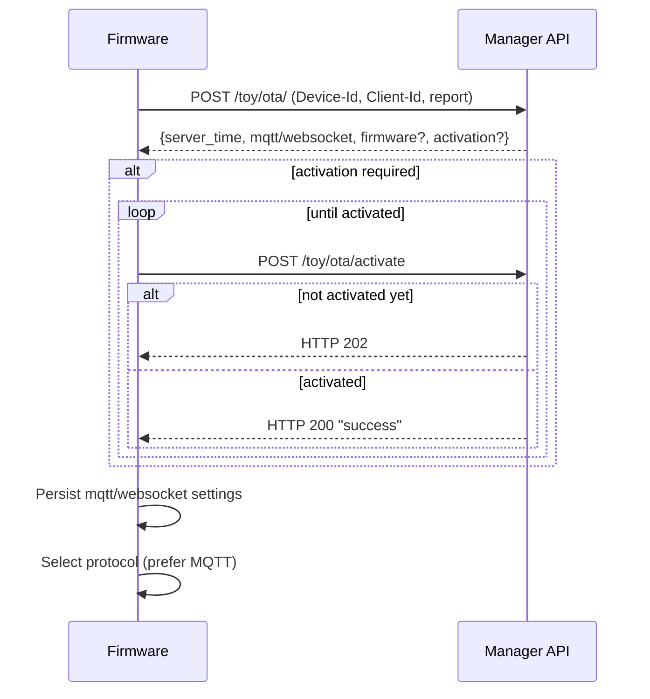
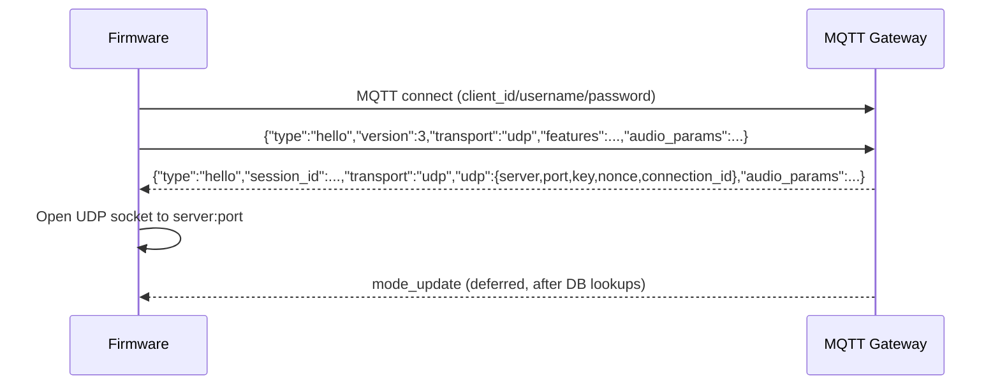
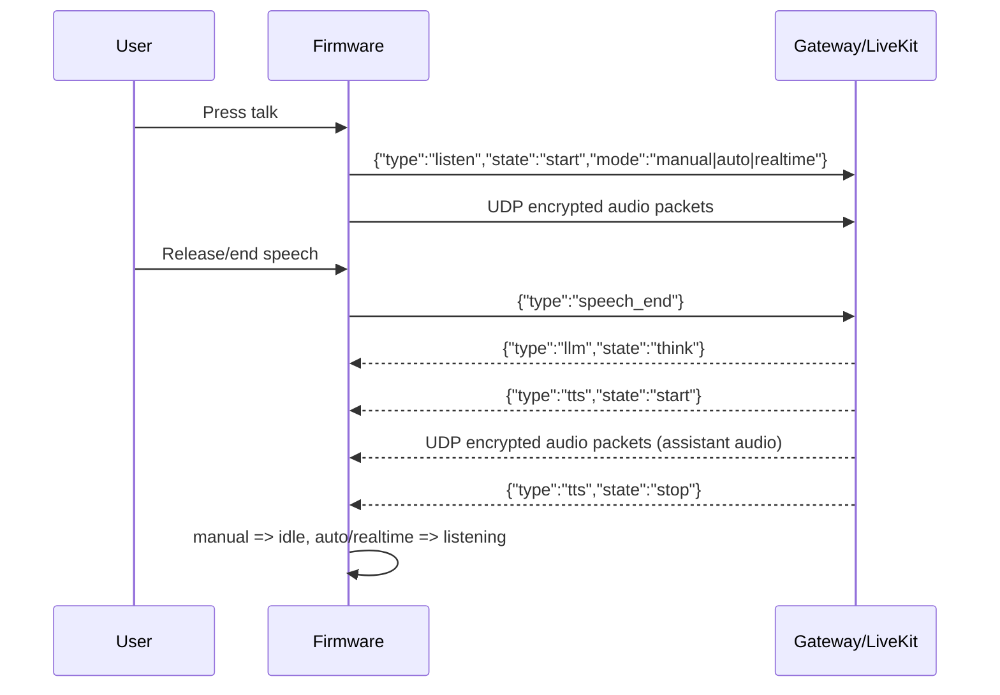
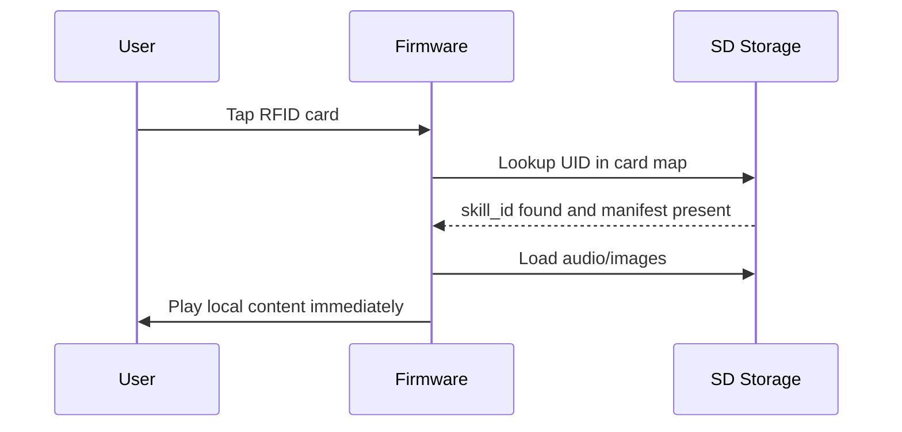
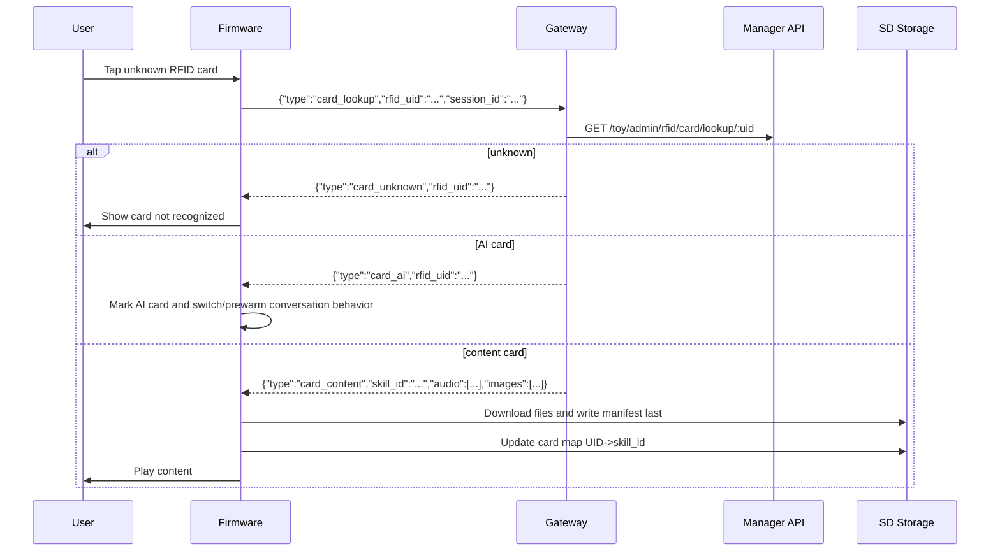
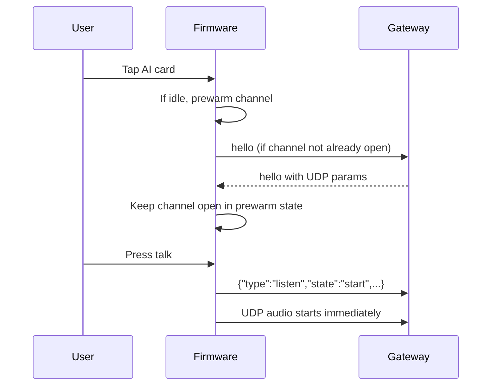

# Cheeko Firmware Implementation Guide (From Scratch)

## Audience
This document is for firmware engineers building a new device firmware that must interoperate with the current Cheeko backend stack.

It intentionally focuses on firmware-relevant behavior and contracts, and skips backend implementation details that firmware does not need.

---

## 1) What The Firmware Must Do

At minimum, implement these flows:

1. Boot and network bring-up.
2. OTA check (`/toy/ota/`) and optional activation loop (`/toy/ota/activate`).
3. MQTT connect using OTA-provided credentials.
4. MQTT `hello` exchange and UDP channel setup.
5. Audio conversation loop:
   - send `listen` states
   - stream encrypted audio over UDP
   - handle `tts/stt/llm` messages
   - send `speech_end` and `abort` when required
6. RFID flow:
   - local SD lookup first
   - if unknown, send `card_lookup`
   - on `card_content`, download assets to SD then play
   - on `card_ai`, switch to conversation behavior
7. Session lifecycle and recovery:
   - handle `goodbye`
   - handle timeouts
   - recover after disconnects

---

## 2) External Interfaces Firmware Uses

## 2.1 Manager API

Base context path is `/toy`.

Required endpoints:

1. `POST /toy/ota/`
2. `POST /toy/ota/activate`
3. OTA binary URL from OTA response, typically `/toy/otaMag/download/<id>`

RFID endpoints are used by gateway (not directly by firmware), but firmware must consume gateway responses that originate from those lookups.

## 2.2 MQTT Gateway

Firmware publishes to:
- `publish_topic` from OTA (currently `device-server`)

Firmware subscribes to:
- `subscribe_topic` from OTA
- if OTA returns `"null"` or empty, fallback to:
  - `devices/p2p/<client_id>`

## 2.3 UDP Audio Channel

Negotiated via MQTT `hello` and server `hello` response.

---

## 3) Device State Model (Recommended)

Use these operational states to match current behavior:

- `starting`
- `wifi_configuring`
- `activating`
- `idle`
- `connecting`
- `listening`
- `speaking`
- `upgrading`
- `audio_testing`
- `fatal_error`

Important transitions:

1. `idle -> connecting -> listening` on chat start.
2. `listening -> speaking` on inbound `tts start`.
3. `speaking -> idle` when manual mode and inbound `tts stop`.
4. `speaking -> listening` when auto/realtime mode and inbound `tts stop`.
5. `listening -> idle` on user stop or timeout.

---

## 4) Scenario Diagrams

## Scenario A: Boot, OTA Check, Activation



### Firmware rules for this scenario

1. Send headers:
   - `Activation-Version`
   - `Device-Id`
   - `Client-Id`
   - `Serial-Number` (if available)
2. Parse and persist:
   - `mqtt` object
   - `websocket` object
   - `server_time`
3. If `activation.challenge` exists, run activation loop.
4. If `firmware` exists:
   - compare versions
   - apply force flag behavior

---

## Scenario B: MQTT Hello And UDP Negotiation



### Firmware rules for this scenario

1. `hello` request should include:
   - `type="hello"`
   - `version=3`
   - `transport="udp"`
   - `features.mcp=true` (if supported)
   - `audio_params` (`opus`, `16000`, mono, frame duration)
2. Wait for server `hello` (timeout recommended: 10s).
3. Extract:
   - `session_id`
   - `udp.server`
   - `udp.port`
   - `udp.key` (hex)
   - `udp.nonce` (hex)
4. Configure AES-128-CTR for UDP packet encryption/decryption.

---

## Scenario C: Conversation Turn (PTT Style)



### Firmware rules for this scenario

1. On `listen start`, start microphone pipeline and UDP uplink.
2. On `speech_end`, stop mic processing and enter thinking UI.
3. On `tts start`, switch to speaking state.
4. On `tts stop`, transition by mode:
   - manual -> idle
   - auto/realtime -> listening

---

## Scenario D: RFID Card Already Cached On SD



### Firmware rules for this scenario

1. Local-first path must be fast and offline-capable.
2. Keep a persistent `UID -> skill_id` map (example: `cardmap.jsn`).
3. Consider skill valid only if completion marker exists (example: `manifest.jsn`).

---

## Scenario E: RFID Unknown -> Gateway Lookup -> Download -> Play



### Firmware rules for this scenario

1. Unknown-card timeout recommended (current flow uses 10s).
2. Download in background task/thread so main event loop stays responsive.
3. Write `manifest` last as completion marker.
4. On card removal during download, avoid auto-play when finished.

---

## Scenario F: AI Card Prewarm And Instant Start



### Firmware rules for this scenario

1. Prewarm only when device is idle.
2. Cancel prewarm on card removal.
3. Do not enter deep sleep while prewarmed channel is active.

---

## 5) API Contracts Firmware Must Parse

## 5.1 `POST /toy/ota/` response schema (relevant fields)

```json
{
  "server_time": {
    "timestamp": 1710000000000,
    "timeZone": "Asia/Kolkata",
    "timezone_offset": 330
  },
  "firmware": {
    "version": "1.2.3",
    "url": "http://.../toy/otaMag/download/<id>",
    "force": 0
  },
  "websocket": { "url": "ws://..." },
  "mqtt": {
    "broker": "...",
    "port": 1883,
    "endpoint": "host:port",
    "client_id": "GID_test@@@AA_BB_CC_DD_EE_FF@@@<uuid>",
    "username": "...",
    "password": "...",
    "publish_topic": "device-server",
    "subscribe_topic": "null"
  },
  "activation": {
    "code": "123456",
    "message": "<frontend_url>\\n123456",
    "challenge": "AA:BB:CC:DD:EE:FF"
  }
}
```

Notes:
- This endpoint returns raw JSON (not `{code,msg,data}` wrapper).
- `activation` may be absent.
- `firmware` may be absent.

## 5.2 `POST /toy/ota/activate` behavior

- `200` + body `success`: activation done.
- `202`: not ready / retry.

## 5.3 OTA request format (what firmware sends)

Firmware should send:

1. Headers:
   - `Activation-Version`
   - `Device-Id` (MAC)
   - `Client-Id`
   - `Serial-Number` (if available)
   - `User-Agent`
   - `Accept-Language`
   - `Content-Type: application/json`
2. Body:
   - device/system report JSON (version + board/chip/app info)
3. Activate payload (`/toy/ota/activate`):
   - with serial-number flow, payload includes:
     - `algorithm` (`hmac-sha256`)
     - `serial_number`
     - `challenge`
     - `hmac`

---

## 6) MQTT Message Contracts

## 6.1 Firmware -> Gateway

1. `hello`
2. `listen` (`state`: `detect|start|stop`)
3. `speech_end`
4. `abort`
5. `goodbye`
6. `mcp`
7. `card_lookup`

Canonical examples:

```json
{"type":"hello","version":3,"transport":"udp","features":{"mcp":true},"audio_params":{"format":"opus","sample_rate":16000,"channels":1,"frame_duration":60}}
{"session_id":"...","type":"listen","state":"start","mode":"manual"}
{"session_id":"...","type":"listen","state":"stop"}
{"session_id":"...","type":"listen","state":"detect","text":"hey cheeko"}
{"session_id":"...","type":"speech_end"}
{"session_id":"...","type":"abort","reason":"wake_word_detected"}
{"session_id":"...","type":"goodbye"}
{"session_id":"...","type":"card_lookup","rfid_uid":"04A1B2C3D4"}
```

## 6.2 Gateway -> Firmware

1. `hello` (server hello with UDP crypto params)
2. `mode_update`
3. `tts` (`start|sentence_start|stop`)
4. `stt`
5. `llm` (text and/or `state=think`, optional `emotion`)
6. `alert`
7. `agent_ready`
8. `card_content`
9. `card_ai`
10. `card_unknown`
11. `goodbye`

Canonical examples:

```json
{"type":"hello","session_id":"...","transport":"udp","udp":{"server":"...","port":1883,"encryption":"aes-128-ctr","key":"...","nonce":"...","connection_id":123},"audio_params":{"sample_rate":24000,"channels":1,"frame_duration":60,"format":"opus"}}
{"type":"mode_update","mode":"conversation","listening_mode":"manual","character":"Cheeko","session_id":"...","timestamp":1710000000000}
{"type":"llm","state":"think","session_id":"..."}
{"type":"tts","state":"start","session_id":"...","text":"optional"}
{"type":"tts","state":"sentence_start","session_id":"...","text":"..."}
{"type":"tts","state":"stop","session_id":"..."}
{"type":"stt","text":"...","session_id":"..."}
{"type":"llm","text":"...","session_id":"..."}
{"type":"llm","text":"...","emotion":"happy","session_id":"..."}
{"type":"card_content","rfid_uid":"...","skill_id":"...","skill_name":"...","version":1,"audio":[{"index":1,"url":"..."}],"images":[{"index":1,"url":"..."}]}
{"type":"card_ai","rfid_uid":"..."}
{"type":"card_unknown","rfid_uid":"..."}
{"type":"goodbye","session_id":"...","reason":"inactivity_timeout"}
```

Implementation note:
- Current firmware code path handles `tts`, `stt`, `llm`, `alert`, `agent_ready`, `card_*`, `system`.
- `mode_update` is currently sent by gateway; new firmware should decide whether to consume it for runtime mode sync.
- `stt` is text-update style in current flow (no `state=start/stop`).
- speaking/listening control is driven by `tts.state`, not by `stt`.

## 6.3 Message semantics -> required firmware behavior

1. `listen state=start`
   - Enter listening behavior.
   - Start mic capture and UDP uplink.
2. `listen state=stop`
   - Stop mic capture.
   - Return to idle unless your UX defines another state.
3. `speech_end`
   - Stop mic capture immediately.
   - Show thinking UI and wait for `tts start`.
4. `tts state=start`
   - Enter speaking behavior.
   - Start/play UDP downlink audio.
5. `tts state=sentence_start`
   - Optional assistant text update for on-screen transcript.
6. `tts state=stop`
   - End speaking behavior.
   - Transition:
     - manual mode -> idle
     - auto/realtime mode -> listening
7. `stt`
   - Update user transcript text on display/log.
   - No state transition required by itself.
8. `llm state=think`
   - Show thinking indicator (before TTS starts).
9. `llm text/emotion`
   - Update assistant text/emotion UI.
   - No transport/state change required.
10. `abort` (firmware -> gateway)
   - Use for interrupting speaking or playback.
   - Send immediately on wake-word interruption during speaking.
11. `goodbye`
   - Close current session and reset local session variables.
12. `card_content`
   - Download `audio/images` to SD.
   - Write `manifest.jsn` last.
   - Update `UID -> skill_id` map.
13. `card_ai`
   - Mark UID as AI card and trigger/prewarm conversation behavior.
14. `card_unknown`
   - Show card-not-recognized UX and stop waiting.

---

## 7) UDP Packet Format (Required)

Header is 16 bytes:

1. byte 0: packet type (`1` for audio)
2. byte 1: flags/reserved
3. bytes 2-3: payload length (uint16 big-endian)
4. bytes 4-7: connection id (uint32 big-endian)
5. bytes 8-11: timestamp (uint32 big-endian)
6. bytes 12-15: sequence (uint32 big-endian)

Payload:
- encrypted Opus bytes using AES-128-CTR
- nonce/counter basis from header/nonce contract returned in `hello`

Validation rules:

1. Ignore packets with invalid type or short length.
2. Track remote sequence and reject out-of-order stale packets.
3. Keep local sequence for uplink packets.

---

## 8) Timeouts And Retries (Recommended Defaults)

Use these compatibility-friendly values:

1. Server hello wait timeout: 10s.
2. Listening inactivity timeout: 30s.
3. Thinking timeout after `speech_end`: 20s.
4. Unknown RFID lookup timeout: 10s.
5. Activation retry:
   - current reference behavior retries up to 10 times per cycle.
   - on HTTP 202, retry after ~3s.
   - on other activation failures, wait ~10s before retry.
6. OTA check retry:
   - current reference behavior retries up to 10 times with exponential backoff starting at 10s.

---

## 9) Persistence Keys (Minimum)

Persist these settings so firmware can reconnect after reboot:

1. MQTT:
   - `endpoint`
   - `client_id`
   - `username`
   - `password`
   - `publish_topic`
   - `subscribe_topic`

2. WebSocket fallback URL.

3. RFID local metadata:
   - `UID -> skill_id` map
   - per-skill manifest marker

---

## 10) Minimal Conformance Checklist

A firmware build is integration-ready when all checks pass:

1. Can complete OTA check and parse `activation/mqtt/firmware/server_time`.
2. Can activate with `/ota/activate` retry behavior.
3. Can MQTT connect with OTA credentials.
4. Can perform `hello` handshake and open UDP channel.
5. Can send uplink audio and play downlink audio via UDP.
6. Can process `tts start/stop` and maintain speaking/listening transitions.
7. Can send `speech_end` and receive response turn correctly.
8. Can send `abort` during speaking and recover to listening.
9. RFID local cache path works fully offline.
10. RFID unknown path works via `card_lookup` and `card_content/card_ai/card_unknown`.
11. Card removal properly stops playback/session.
12. Handles `goodbye` cleanly and can start a new session.

---

## 11) Source-Of-Truth Code Anchors

Firmware side:
- `D:\\cheekov2-hardware\\main\\ota.cc`
- `D:\\cheekov2-hardware\\main\\application.cc`
- `D:\\cheekov2-hardware\\main\\protocols\\protocol.cc`
- `D:\\cheekov2-hardware\\main\\protocols\\mqtt_protocol.cc`
- `D:\\cheekov2-hardware\\main\\device_state_machine.cc`
- `D:\\cheekov2-hardware\\main\\boards\\common\\content_manager.cc`
- `D:\\cheekov2-hardware\\main\\boards\\jiuchuan-s3\\jiuchuan_dev_board.cc`

Gateway/API side interfaces consumed by firmware:
- `D:\\cheeko-backend\\main\\manager-api-node\\src\\routes\\ota.routes.js`
- `D:\\cheeko-backend\\main\\manager-api-node\\src\\services\\device.service.js`
- `D:\\cheeko-backend\\main\\mqtt-gateway\\mqtt\\virtual-connection.js`
- `D:\\cheeko-backend\\main\\mqtt-gateway\\gateway\\mqtt-gateway.js`
- `D:\\cheeko-backend\\main\\mqtt-gateway\\livekit\\livekit-bridge.js`
