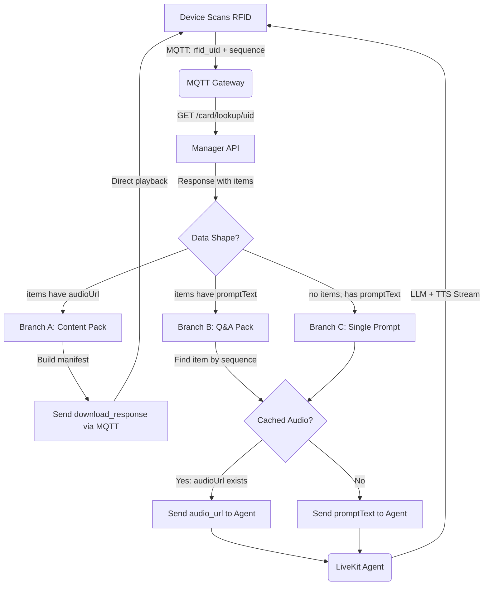

# PRD: RFID Smart Routing & Content Delivery Optimization

**Status:** Implemented
**Last Updated:** 2026-01-31

---

## 1. Overview

The MQTT Gateway implements a "Smart Routing" mechanism that classifies RFID-triggered content at the gateway level and routes it optimally. Static content (stories, rhymes, habits) is delivered as a manifest directly to the device via MQTT, bypassing LiveKit entirely. Dynamic content (Q&A prompts) is forwarded to the LiveKit Agent for real-time LLM generation.

## 2. Problem Statement

Previously, all RFID scans were routed through the LiveKit Agent (Python Worker).

1. **Inefficiency:** Pre-recorded stories and nursery rhymes were streamed via LiveKit/ElevenLabs, consuming expensive minutes for static content.
2. **Latency:** The device waited for the Agent to receive, process, and stream audio.
3. **Complexity:** The Agent code handled non-AI tasks like read-only playback and animal sounds.

## 3. Goals

1. **Reduce Latency:** Direct URL playback for static content is near-instant.
2. **Cost Reduction:** Bypass LiveKit and LLMs for pre-recorded content.
3. **Code Simplification:** Remove non-AI logic from the Python Agent.

---

## 4. Architecture (The "Smart Router")

The **MQTT Gateway** (`mqtt-gateway.js`) acts as the decision maker using **data-shape detection** — it inspects the items returned by the API rather than relying on `contentType` string matching.

### 4.1. Classification Logic

```javascript
// Data-shape detection (not string matching)
const hasItems = Array.isArray(items) && items.length > 0;
const isContentPack = hasItems && items.some(item => item.audioUrl);   // Has pre-recorded audio
const isQaPack     = hasItems && !isContentPack && items.some(item => item.promptText); // Has prompts for LLM
```

This handles any `content_type` value (`story_pack`, `rhyme_pack`, `habit_pack`, `prompt_pack`, etc.) without needing to enumerate them.

### 4.2. The Workflow

1. **Device** scans RFID card.
   - Sends MQTT message type `text_greeting` or `start_greeting_text` with payload: `{ rfid_uid, sequence }`.

2. **MQTT Gateway** receives the scan.
   - Calls **Manager API**: `GET /toy/admin/rfid/card/lookup/{rfid_uid}`
   - Classifies response by data shape.

3. **Branch A — Content Pack** (items have `audioUrl`):
   - Gateway builds a `download_response` manifest from the lookup data.
   - Sends manifest directly to device via MQTT topic `devices/p2p/{clientId}`.
   - **No LiveKit connection needed.** Returns immediately.

4. **Branch B — Q&A Pack** (items have `promptText`):
   - Gateway finds the item matching the requested `sequence` (defaults to 1).
   - Extracts `promptText` and optional `cachedAudioUrl`.
   - Forwards prompt to the LiveKit Agent via data channel.
   - Agent generates answer (LLM + TTS) and streams audio to device.

5. **Branch C — Single Prompt** (no items array):
   - Uses top-level `promptText` directly.
   - Routes to LiveKit Agent same as Branch B.

### 4.3. Flow Diagram



---

## 5. Technical Specification

### 5.1. Manager API Endpoint

**Endpoint:** `GET /toy/admin/rfid/card/lookup/{rfidUid}`

**Response** (actual format):
```json
{
  "code": 0,
  "msg": "success",
  "data": {
    "rfid_uid": "E96C8A81",
    "contentType": "prompt_pack",
    "packCode": "ANIMALS_QA",
    "packName": "Animal Friends Q&A",
    "items": [
      {
        "sequence": 1,
        "title": "Tell me what you know about dogs...",
        "promptText": "Tell me what you know about dogs. What sound does a dog make?",
        "audioUrl": null,
        "allowCaching": true,
        "systemPromptOverride": null
      },
      {
        "sequence": 2,
        "title": "What do you know about cats?...",
        "promptText": "What do you know about cats? How does a cat say hello?",
        "audioUrl": null,
        "allowCaching": true,
        "systemPromptOverride": null
      }
    ]
  }
}
```

For Content Packs, items have `audioUrl` and `imageUrl` instead of `promptText`:
```json
{
  "code": 0,
  "msg": "success",
  "data": {
    "rfid_uid": "12345678",
    "contentType": "story_pack",
    "packCode": "BEDTIME_01",
    "packName": "Bedtime Stories",
    "version": 1,
    "items": [
      {
        "sequence": 1,
        "title": "The Sleepy Bear",
        "audioUrl": "https://s3.../bedtime/track_01.mp3",
        "imageUrl": "https://s3.../bedtime/thumb_01.png"
      }
    ]
  }
}
```

### 5.2. MQTT Gateway Smart Routing (`mqtt-gateway.js`)

**Trigger:** MQTT message type `text_greeting` or `start_greeting_text` with `rfid_uid` field.

**Accepted payload fields:**
- `rfid_uid` / `rfidUid` — Card UID (required)
- `sequence` / `seq` / `sl_no` — Item sequence number (optional, defaults to 1)

**Branch A — Content Pack manifest:**

The gateway builds a `download_response` message and publishes it directly to the device's MQTT topic. No LiveKit connection is required.

```json
{
  "type": "download_response",
  "status": "download_required",
  "rfid_uid": "12345678",
  "pack_code": "BEDTIME_01",
  "pack_name": "Bedtime Stories",
  "version": "1.0.0",
  "total_items": 10,
  "files": {
    "audio_1": "https://s3.../track_01.mp3",
    "image_1": "https://s3.../thumb_01.png",
    "audio_2": "https://s3.../track_02.mp3",
    "image_2": "https://s3.../thumb_02.png"
  }
}
```

Published to topic: `devices/p2p/{clientId}`

**Branch B — Q&A Pack routing to LiveKit Agent:**

The gateway finds the item matching the requested sequence, extracts the prompt, and sends it to the agent via LiveKit data channel.

```json
{
  "type": "user_text",
  "text": "Tell me what you know about dogs. What sound does a dog make?",
  "device_id": "00:16:3E:AC:B5:38",
  "session_id": "uuid_session",
  "source": "rfid",
  "rfid_uid": "E96C8A81",
  "sequence": 1,
  "content_type": "prompt",
  "audio_url": null,
  "system_prompt_override": null,
  "timestamp": 1738320000000
}
```

### 5.3. Device Firmware Requirements

The device must handle the `download_response` message type:

1. Parse `files` object to extract `audio_N` and `image_N` URLs.
2. Display thumbnails in UI for track selection.
3. Download/stream audio from the provided HTTP URLs.
4. Pause/mute LiveKit audio stream if active during playback.
5. Resume LiveKit listening after playback finishes.

### 5.4. Database Schema

#### `rfid_card_mapping` — Links RFID cards to content
| Column | Type | Description |
|--------|------|-------------|
| `id` | BIGSERIAL PK | |
| `rfid_uid` | VARCHAR(100) UNIQUE | Physical card UID (hex) |
| `content_pack_id` | BIGINT FK | Reference to `rfid_content_pack` |
| `question_pack_id` | BIGINT FK | Reference to `rfid_question_pack` |
| `question_id` | BIGINT FK | Single question reference |
| `pack_id` | BIGINT FK | Physical product SKU (`rfid_pack`) |
| `action_type` | VARCHAR(50) | `content` or `qna` |
| `active` | BOOLEAN | Card enabled/disabled |

#### `rfid_content_pack` — Content collections (stories, rhymes, habits)
| Column | Type | Description |
|--------|------|-------------|
| `id` | BIGSERIAL PK | |
| `pack_code` | VARCHAR(100) UNIQUE | e.g. `BEDTIME_01` |
| `name` | VARCHAR(255) | Display name |
| `content_type` | VARCHAR(50) | `story_pack`, `rhyme_pack`, `habit_pack` |
| `version` | INTEGER | For offline sync/updates |
| `status` | VARCHAR(20) | `draft` / `published` |

#### `content_item` — Tracks within a content pack (up to 10)
| Column | Type | Description |
|--------|------|-------------|
| `id` | BIGSERIAL PK | |
| `content_pack_id` | BIGINT FK | Parent pack |
| `item_number` | INTEGER | Sequence (1-10) |
| `title` | VARCHAR(255) | Track title |
| `audio_url` | VARCHAR(500) | S3 link to audio |
| `image_url` | VARCHAR(500) | S3 link to thumbnail |
| `audio_duration_ms` | BIGINT | Duration for UI display |
| UNIQUE | | `(content_pack_id, item_number)` |

#### `rfid_question_pack` — Reusable Q&A collections
| Column | Type | Description |
|--------|------|-------------|
| `id` | BIGSERIAL PK | |
| `pack_code` | VARCHAR(100) UNIQUE | e.g. `ANIMALS_QA` |
| `name` | VARCHAR(255) | Display name |
| `question_ids` | JSONB | Array of question IDs (max 10) |
| `version` | INTEGER | For versioning |
| `status` | VARCHAR(20) | `draft` / `published` |

#### `rfid_question` — Individual Q&A prompts
| Column | Type | Description |
|--------|------|-------------|
| `id` | BIGSERIAL PK | |
| `code` | VARCHAR(100) UNIQUE | e.g. `Q_DOG_01` |
| `title` | VARCHAR(255) | Short display text |
| `prompt_text` | TEXT | Full prompt sent to LLM |
| `system_prompt_override` | TEXT | Optional custom system prompt |
| `allow_caching` | BOOLEAN | If true, cache generated audio |
| `cached_audio_url` | VARCHAR(500) | Auto-populated after first generation |

#### `rfid_pack` — Physical product SKUs
| Column | Type | Description |
|--------|------|-------------|
| `id` | BIGSERIAL PK | |
| `pack_code` | VARCHAR(100) UNIQUE | Product SKU |
| `pack_name` | VARCHAR(255) | Product name |

### 5.5. Python Worker (`cheeko_worker.py`)

The agent receives `user_text` messages with `source: "rfid"` and processes them as standard prompts:
- If `audio_url` is present, the agent can skip generation and play cached audio.
- If `system_prompt_override` is present, the agent uses it for this interaction.
- If `allow_caching` is true, the agent should save generated audio to S3 and update the `cached_audio_url` in the database (future enhancement).

---

## 6. Key Implementation Details

### 6.1. Content Pack Routing Bypasses LiveKit

Content Packs are handled **before** the LiveKit connection check. This is critical because:
- The device may not have an active LiveKit room when scanning a content pack card.
- No agent processing is needed — the gateway sends the manifest directly.
- The gateway returns immediately after publishing the MQTT message.

### 6.2. Data-Shape Detection

The gateway does **not** match on `contentType` strings. Instead:
- `isContentPack = items.some(item => item.audioUrl)` — items with pre-recorded audio
- `isQaPack = items.some(item => item.promptText)` — items with LLM prompts

This decouples the gateway from backend naming conventions and handles any future content types automatically.

### 6.3. Q&A Sequence Selection

For Q&A Packs, the gateway:
1. Looks for an item matching the requested `sequence` number.
2. Falls back to the first item if the sequence is not found.
3. Extracts `promptText` from the matched item.
4. Includes `audioUrl` if cached audio exists (agent can skip generation).
5. Includes `systemPromptOverride` if the question has a custom system prompt.

### 6.4. URL Encoding

Audio URLs with spaces are encoded using `encodeUrlPath()` which replaces spaces with `%20` without double-encoding the rest of the URL.

---

## 7. API Endpoints

### RFID Card Management
| Method | Endpoint | Description |
|--------|----------|-------------|
| GET | `/admin/rfid/card/lookup/{uid}` | Lookup card by RFID UID (used by gateway) |
| GET | `/admin/rfid/card/page` | Paginated card mappings |
| POST | `/admin/rfid/card` | Create card mapping |
| PUT | `/admin/rfid/card/:id` | Update card mapping |
| DELETE | `/admin/rfid/card` | Batch delete mappings |

### Content Packs
| Method | Endpoint | Description |
|--------|----------|-------------|
| GET | `/admin/rfid/content-pack/page` | Paginated content packs |
| GET | `/admin/rfid/content-pack/list` | All content packs |
| POST | `/admin/rfid/content-pack` | Create content pack |
| PUT | `/admin/rfid/content-pack/:id` | Update content pack |
| DELETE | `/admin/rfid/content-pack` | Batch delete |

### Question Packs
| Method | Endpoint | Description |
|--------|----------|-------------|
| GET | `/admin/rfid/question-pack/page` | Paginated question packs |
| GET | `/admin/rfid/question-pack/list` | All question packs |
| POST | `/admin/rfid/question-pack` | Create question pack |
| PUT | `/admin/rfid/question-pack/:id` | Update question pack |
| DELETE | `/admin/rfid/question-pack` | Batch delete |

### Questions
| Method | Endpoint | Description |
|--------|----------|-------------|
| GET | `/admin/rfid/question/page` | Paginated questions |
| GET | `/admin/rfid/question/list` | All questions |
| POST | `/admin/rfid/question` | Create question |
| PUT | `/admin/rfid/question/:id` | Update question |
| DELETE | `/admin/rfid/question` | Batch delete |

---

## 8. Success Metrics

| Metric | Target | How |
|--------|--------|-----|
| Content Pack latency | < 500ms scan-to-manifest | Gateway sends manifest directly (no LiveKit) |
| Q&A latency | < 3s scan-to-audio | Gateway extracts prompt, agent streams TTS |
| Cost reduction | 0 LiveKit/ElevenLabs usage for content packs | Manifest contains direct S3 URLs |
| Cached Q&A | 0 LLM usage for repeat questions | Agent checks `audio_url` before generating |

---

## 9. Files Modified

| File | Changes |
|------|---------|
| `mqtt-gateway/gateway/mqtt-gateway.js` | Smart routing logic, `fetchRfidContentFromManagerApi()`, manifest builder |
| `mqtt-gateway/mqtt/virtual-connection.js` | MAC regex fix (case-insensitive), race condition fix in `close()` |
| `manager-api-node/src/services/rfid.service.js` | `lookupCardByUid()` returns full pack data with items |
| `manager-api-node/src/routes/rfid.routes.js` | Card lookup endpoint |
| `manager-api-node/scripts/complete-schema.sql` | Full schema with 6 RFID tables |
| `manager-web/src/views/RfidManagement.vue` | Admin UI for managing cards, packs, questions |
| `manager-web/src/components/RfidCardDialog.vue` | Card mapping dialog with Q&A Pack / Content Pack selector |
