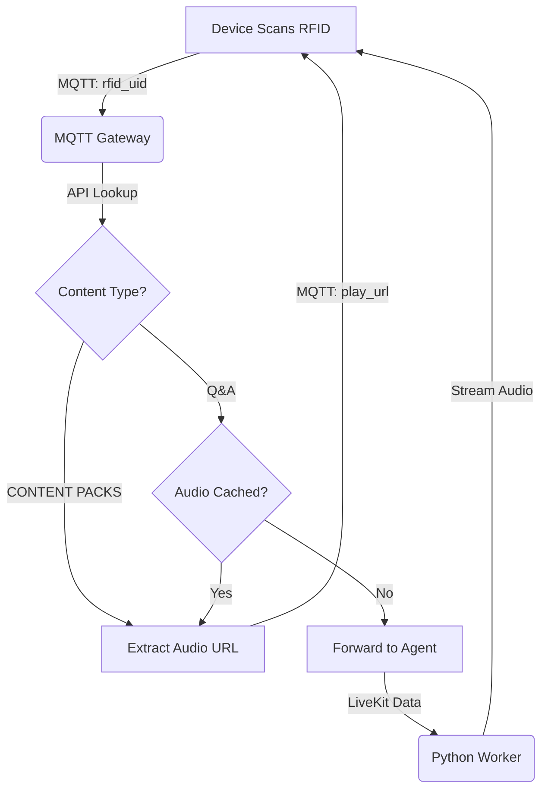

# PRD: RFID Smart Routing & Content Delivery Optimization

## 1. Overview
This feature implements a "Smart Routing" mechanism within the MQTT Gateway to optimize the delivery of RFID-triggered content. By distinguishing between "Static" content (Stories/Rhymes) and "Dynamic" content (Q&A) at the gateway level, we significantly reduce latency, operational costs (LiveKit/LLM usage), and dependency on real-time generation.

## 2. Problem Statement
Currently, all RFID scans are routed through the LiveKit Agent (Python Worker).
1.  **Inefficiency:** pre-recorded stories and nursery rhymes are "streamed" via LiveKit/ElevenLabs, consuming expensive minutes and generation credits for static content.
2.  **Latency:** The device waits for the Agent to receive, process, and stream audio, introducing unnecessary delay.
3.  **Complexity:** The Agent code is bloated with logic for handling "read_only" types and animal sounds, which are not true AI tasks.

## 3. Goals
1.  **Reduce Latency:** Direct URL playback for static content is near-instant.
2.  **Cost Reduction:** Bypass LiveKit and LLMs for content that already exists (Stories, Rhymes, Cached Q&A).
3.  **Code Simplification:** Remove non-AI logic from the Python Agent.

## 4. Proposed Architecture (The "Smart Router")

The **MQTT Gateway** will act as the decision maker.

### 4.1. The Workflow

1.  **Device:**
    *   Scans RFID.
    *   Sends MQTT message: `start_greeting_text` (payload: `rfid_uid`).

2.  **MQTT Gateway:**
    *   Receives `rfid_uid`.
    *   Calls **Manager API** to retrieve content metadata.
    *   **Decision Logic:**
        *   **Branch A (Content Pack / Story / Rhyme):** Static pre-recorded content.
            *   **Action:** Gateway fetches the **full manifest** (10 Items with Audio URLs + Thumbnails) and sends it to the device (`download_response` or `manifest_data`).
            *   **Result:** Device displays thumbnails and plays distinct audio files directly.

        *   **Branch B (Q&A Pack):** Dynamic AI content.
            *   **Action:** Gateway finds the specific item for the requested `sequence`.
            *   **Routing:** Extracts the `prompt_text` (e.g., "Why is grass green?") and sends it to the **LiveKit Agent**.
            *   **Result:** Agent generates and streams the answer.

3.  **LiveKit Agent (Python):**
    *   Receives Prompt.
    *   Generates Answer (LLM + TTS).
    *   Streams Audio to Device.

### 4.2. Logic Flow Diagram



## 5. Technical Requirements

### 5.1. Manager API Updates
*   **Endpoint:** `/admin/rfid/card/lookup/{uid}`
*   **Response Payload:** Must support "Pack" metadata.
    ```json
    {
      "type": "story_pack" | "rhyme_pack" | "qna",
      "items": [
          { "sequence": 1, "title": "...", "audioUrl": "...", "imageUrl": "..." },
          { "sequence": 2, "title": "...", "audioUrl": "...", "imageUrl": "..." }
      ],
      "selectedItem": { ... } (If sequence was passed),
      "prompt": "..." (Nullable)
    }
    ```

### 5.2. MQTT Gateway Updates (`mqtt-gateway.js`)
*   **Pack Handling:**
    *   If `type` ends in `_pack`:
        *   Look for `sequence` in the incoming message.
        *   If `sequence` matches an item, extract that specific `audioUrl`.
        *   If no `sequence`, potentially trigger `download_response` flow (sending full manifest) so device can populate UI.
*   **Command Sender:**
    *   Topic: `cheeko/{mac}/command`
    *   Payload: `{ "type": "play_url", "url": "...", "title": "...", "image_url": "..." }`

### 5.3. Device Firmware Requirements
*   **New Capability:** Must handle `play_url` command.
    1.  Pause/Mute LiveKit audio stream (if active).
    2.  Download/Stream from the provided HTTP URL.
    3.  Resume LiveKit listening after playback finishes.

### 5.4. Database Schema Requirements
This architecture relies on the following schema optimization in the Manager API:

1.  **`content_packs`** (The Album)
    *   `id`: INT (PK)
    *   `name`: VARCHAR
    *   `version`: INT (CRITICAL for offline sync/updates)
    *   `status`: ENUM ('draft', 'published')

2.  **`pack_items`** (The Tracks - Supports 10+ items)
    *   `pack_id`: INT (FK)
    *   `sequence`: INT (1-10, defines order)
    *   `title`: VARCHAR
    *   `audio_url`: VARCHAR (S3 Link)
    *   `image_url`: VARCHAR (Thumbnail for device UI)

3.  **`qna_prompts`** (Smart Cards)
    *   `rfid_uid`: VARCHAR (FK)
    *   `prompt_text`: TEXT
    *   `allow_caching`: BOOLEAN (True = Static, False = Dynamic/Live)
    *   `cached_audio_url`: VARCHAR (Auto-populated by Agent)

### 5.5. Python Worker Cleanup (`cheeko_worker.py`)
*   Remove `read_only` and `animal` logic from `handle_user_text`.
*   Worker becomes purely "Prompt -> Answer".
*   **New Feature:** "Auto-Cache Loop" - If `allow_caching` is true, save generated audio to S3 and update DB.

## 6. Success Metrics
*   **Latency:** Time from Scan to Audio Start < 1.5s for cached/static content.
*   **Cost:** Reduced LiveKit/ElevenLabs usage for repeat interactions.
*   **Reliability:** Offline/Pre-cached functionality (if URL is local/cached on device).
