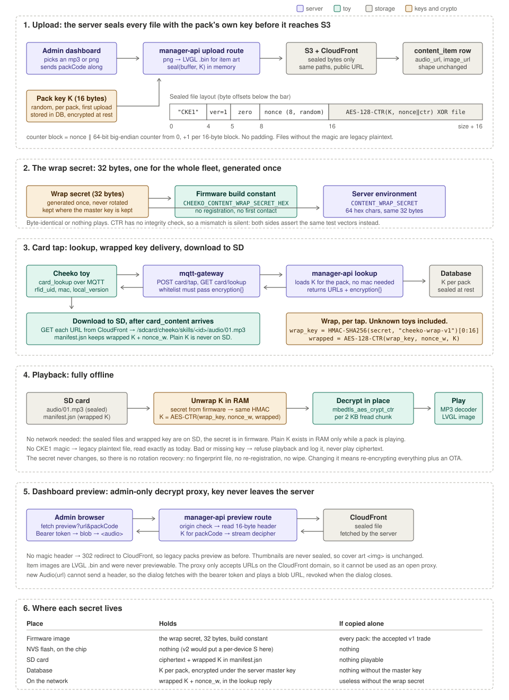

# SD content encryption

Downloaded content on the toy's SD card is stored in the clear today. Pull the card, put it in a laptop, and every purchased MP3 is an ordinary file. The same files are also reachable as public CloudFront URLs through the unauthenticated card lookup, so anyone who reads a card's UID with a phone can fetch them without a toy. This document describes how to seal that content, in two versions that share one file format.



The diagram shows version 2. Version 1 is the same picture with the per-pack key replaced by one global key compiled into firmware, and without section 2.

**Scope.** Downloaded content only: pack audio, pack item images, custom-card recordings, character sprites. Built-in UI art, themes, `cardmap.jsn` and logs stay plaintext. Pack thumbnails stay plaintext because the dashboard shows them in an ``.

**Out of scope.** Secure Boot and RFID card authenticity. Note that a cloned card UID gets a clean download from CloudFront in either version, so per-device keys buy little until card authenticity is addressed.

---

## 1. How content flows today

Verified against the code, September 2026.

| Step | Where | What happens |
|---|---|---|
| Upload | `src/routes/rfid.routes.js` `POST /admin/rfid/content-pack/upload` | Multer holds the file in memory. PNG/JPEG item art is converted to an LVGL RGB565 `.bin` by `toDeviceArtwork`. `uploadService.uploadContentFile` writes to S3 bucket `cheeko-music-files` under `rfidcontent/<category>/<name>-<uuid8>.<ext>` with `Cache-Control: max-age=31536000`, and returns a public CloudFront URL. |
| Save | `rfidService.createContentPack` / `updateContentPack` | Pack row in `rfid_content_pack`, one `content_item` row per item holding `audio_url` and `image_url`. |
| Tap | firmware `ContentManager::OnCardTapped` | If the card is already on SD, play immediately. Otherwise send `card_lookup` over MQTT with `rfid_uid`, `mac_address`, `local_version`, `local_content_hash`. |
| Lookup | `main/mqtt-gateway/gateway/mqtt-gateway.js` `card_lookup` handler | `POST /admin/rfid/card/tap` for the version handshake, then `GET /admin/rfid/card/lookup/<uid>?mac=` . Both are unauthenticated. `fetchRfidContentFromManagerApi` copies an explicit whitelist of fields. Publishes `card_content` with `audio[]` / `images[]` or `stories[]` URLs to `devices/p2p/<clientId>`. |
| Download | firmware `ContentManager::HandleServerResponse` | Plain HTTP GET per URL into `/sdcard/cheeko/skills/<id>/audio/01.mp3`, `images/01.bin`, or `s01/...` for grouped packs. `manifest.jsn` is written last as the completion marker. |
| Play | `main/audio/mp3_player.cc`, `cheeko_sd_image_loader.cc` | MP3 read in 2048-byte `fread` chunks, no seeks. Images read whole into PSRAM, then the 12-byte LVGL header is checked. |

Also verified: there is no per-device secret anywhere today. The MQTT password is an HMAC of client id plus username under one global `mqtt.signature_key`, and the client id contains a per-call UUID that is never stored. The firmware signs an activation challenge with the eFuse HMAC peripheral, but the backend ignores that field. Flash encryption is not enabled (`CONFIG_SECURE_FLASH_ENC_ENABLED` is unset).

---

## 2. Threat model

| Attack | Version 1 | Version 2 |
|---|---|---|
| Parent copies the SD card and shares the folder | stopped | stopped |
| Anyone fetches the CloudFront URLs from the public lookup | stopped | stopped |
| Copied SD card used in another Cheeko that also has the card | works | stopped |
| One firmware image is dumped | all packs on all toys exposed | nothing exposed |
| One toy's flash is dumped | all packs on all toys exposed | that toy's packs only |
| Owner dumps their own flash | exposes K | exposes S, unless flash encryption is on |
| Recording the speaker | never stoppable | never stoppable |

ESP32 flash encryption is what closes the flash-dump rows. It protects the firmware image (version 1's K) and NVS (version 2's S) equally. It is a separate feature from Secure Boot, but enabling it in release mode is one-way per chip and changes how boards are flashed on the line. Treat it as its own project and start in development mode.

---

## 3. File format, shared by both versions

```
offset  size  field
0       4     magic "CKE1"
4       1     version: 1 = global key K, 2 = per-pack K delivered wrapped
5       3     reserved, zero
8       8     nonce, random per file
16      ..    AES-128-CTR ciphertext of the original file
```

- Counter block is `nonce(8) || counter(8, big-endian, from 0)`, incremented per 16-byte block.
- No padding. File length is original + 16.
- CTR is a stream cipher, so any 16-byte block decrypts independently. The toy decrypts each 2 KB chunk in place as it is read.
- A file without the magic is plaintext and is read exactly as today. This is what makes rollout safe and removes the need to re-encrypt anything when moving from version 1 to version 2.
- CTR provides confidentiality only, no integrity tag. Bit flips decrypt to garbage rather than failing. For this threat that is fine. If tamper detection is ever needed, add a hash to the download manifest rather than switching modes.
- Filenames do not change. 8.3 only (`CONFIG_FATFS_LFN_NONE=y`).

---

## 4. Sealing on upload

Same code for both versions. Only the source of `key` differs.

```js
// src/services/upload.service.js
const MAGIC = Buffer.from('CKE1');

function seal(plain, key, version = 1) {
  const nonce = crypto.randomBytes(8);
  const iv = Buffer.concat([nonce, Buffer.alloc(8, 0)]);
  const body = crypto.createCipheriv('aes-128-ctr', key, iv).update(plain);
  const header = Buffer.alloc(16);
  MAGIC.copy(header, 0);
  header[4] = version;
  nonce.copy(header, 8);
  return Buffer.concat([header, body]);
}
```

```js
// src/routes/rfid.routes.js, upload handler, after toDeviceArtwork
const body = isPackThumbnail ? artwork.buffer : seal(artwork.buffer, contentKey, ENC_VERSION);
const result = await uploadService.uploadContentFile(body, artwork.filename, 'rfidcontent', category, artwork.mimeType);
```

- Sealing happens in memory on the server. Multer never touches disk. Only sealed bytes reach S3.
- Apply the same `seal` at the other S3 writers whose output lands on an SD card: custom-card audio and image, character art. Everything else stays plaintext.
- Gate on `CONTENT_ENC_KEY` (version 1) or `CONTENT_MASTER_KEY` (version 2) being set, so local and test environments keep working and production rollout is an env flip.
- S3 keys, CloudFront URLs, `Cache-Control`, and the `content_item` row are unchanged. Nothing downstream knows encryption happened.
- The MCP's `upload_pack_file` posts through the same route and gets sealed automatically. No MCP change.

---

## 5. Version 1: one global key

**Key K.** 16 bytes. Backend: `CONTENT_ENC_KEY` env var, hex. Firmware: build-time define `-DCHEEKO_CONTENT_KEY=<32 hex>`, with `#error` in release builds if missing. K never travels over the network and is never written to the SD card.

**Backend.** `seal` at upload, the preview proxy in section 8, and the backfill in section 9. No schema change. No gateway change. Lookup, tap handshake and `card_content` are untouched.

**Firmware.**

- `main/boards/common/content_crypto.{h,cc}`: `IsEncrypted(head16)` plus a thin wrapper over `mbedtls_aes_setkey_enc` and `mbedtls_aes_crypt_ctr` holding key, nonce counter, `nc_off` and `stream_block`. These are the same calls `mqtt_protocol.cc` already uses for UDP audio, so no new dependency and the hardware AES block is used automatically. mbedtls carries the partial keystream block across calls, so unaligned chunk boundaries need no extra code.
- `mp3_player.cc`: after `fopen`, read 16 bytes. If magic, keep the nonce and decrypt every `fread` chunk in place before the decoder. If not, `fseek(0)` and proceed as today. No new allocation.
- `cheeko_sd_image_loader.cc` and `LoadBinFile` in character art: after the whole-file read into PSRAM, decrypt in place before the existing LVGL header check. The 12 KB internal-heap guard is untouched.
- Failure is loud: bad magic version or a decrypt that yields a non-MP3 or non-LVGL header refuses playback, logs a telemetry marker with the pack id, and shows an on-screen message. Never fall through to the decoder with ciphertext.

**Rule.** K must never change across firmware releases, or every pack on every SD card in the field stops playing after the OTA.

---

## 6. Version 2: per-pack key, per-device secret

Adds two keys and one registration step on top of version 1. Files, `seal`, the readers and the preview proxy are identical.

**Pack key K.** 16 random bytes per pack, generated on first upload for that pack. The upload dialog sends `packCode` with each file so the server can `getOrCreatePackKey(packCode)` before the pack row exists.

**Device secret S.** 32 random bytes the toy generates itself on first boot and stores in NVS flash, namespace `cheeko`, key `dev_secret`. It registers S once with the backend by including it in the OTA check the toy already makes. No factory step. NVS survives restarts and power loss.

**Schema.**

```sql
ALTER TABLE rfid_content_pack ADD COLUMN content_key BYTEA;      -- K, encrypted at rest
ALTER TABLE ai_device          ADD COLUMN content_secret BYTEA;   -- S, encrypted at rest
```

Both columns are encrypted under one server master key, `CONTENT_MASTER_KEY`, from the environment or KMS, never a literal in the repo. Decide where it lives before the first K is written, because retrofitting means re-wrapping every stored key. Normalise the MAC on write and on read; the codebase already has two RFID UID normalisations that disagree.

**Key delivery at lookup.** In `lookupCardByUid`, content-pack branch, and in `buildCharacterArt` for sprites:

```
wrap_key = HMAC-SHA256(S, "cheeko-wrap-v1")[0:16]
wrapped  = AES-128-CTR(wrap_key, nonce_w, K)        nonce_w random per response
```

The lookup response gains `encryption: { v: 2, key: <wrapped hex>, nonce: <nonce_w hex> }`. Omit the field for unencrypted packs. If the device is unknown or has no S, for example after a mainboard swap, return the pack unencrypted rather than failing the tap.

The lookup stays public. The wrapped key is useless without S, so it is safe to hand to anyone.

**Gateway.** `fetchRfidContentFromManagerApi` in `mqtt-gateway.js` returns an explicit field whitelist. Add `encryption` to it and to the `card_content` payload it publishes. `virtual-connection.js` spreads `...cardData` and carries the field automatically, so the two senders differ until the whitelist is updated. Test both paths. This exact trap hid character artwork for weeks.

**Firmware, on top of version 1.**

- First boot: if `dev_secret` is absent, generate with `esp_random`, store, mark for registration. Include S in the next OTA check.
- `HandleServerResponse`: parse `encryption` from `card_content` and `card_ai`, write `wrapped` and `nonce_w` into `manifest.jsn`. Never write plain K to SD.
- Playback start: read S from NVS, compute the same HMAC, unwrap K in RAM, hand it to the decryptor. Drop K when playback ends.
- If NVS is erased, the toy generates a new S and every wrapped key on the SD card is dead. Treat "new S" as "wipe `cardmap.jsn` and `skills/`", so the next tap re-downloads cleanly instead of failing to decrypt.

**Why HMAC then AES rather than encrypting with S directly.** S can later move into the ESP32-S3 HMAC peripheral, where the key is eFuse-backed and never readable even by firmware, without changing the file format or re-encrypting anything. Only the derivation of `wrap_key` moves.

---

## 7. Offline playback

Works in both versions, because nothing needed at playback time comes from the network: sealed files and the wrapped key are on the SD card, S is in NVS, K is in firmware (v1) or unwrapped in RAM (v2). `OnCardTapped` plays a known card immediately and does not wait for the `card_lookup` reply. The 10-second timeout only applies to cards the toy has never seen.

Offline does not work for a card that was never downloaded, exactly as today.

---

## 8. Dashboard preview

`RfidContentPackDialog.vue` plays item audio with `new Audio(cloudfrontUrl)`. Sealed files break that. Add one admin-only route that decrypts on the server and streams the result. The key never reaches the browser.

```js
router.get('/content-pack/preview', requireAdmin, asyncHandler(async (req, res) => {
  const { url, packCode } = req.query;
  if (!url.startsWith(`https://${CLOUDFRONT_DOMAIN}/`)) return badRequest(res, 'Bad url'); // not an open proxy
  const upstream = await fetch(url);
  const head = Buffer.from(await upstream.clone().arrayBuffer()).subarray(0, 16);
  if (!head.subarray(0, 4).equals(MAGIC)) return res.redirect(url);       // legacy plaintext
  const key = head[4] === 2 ? await getPackKey(packCode) : GLOBAL_KEY;
  const iv = Buffer.concat([head.subarray(8, 16), Buffer.alloc(8, 0)]);
  res.type(url.endsWith('.mp3') ? 'audio/mpeg' : 'application/octet-stream');
  Readable.fromWeb(upstream.body).pipe(skipBytes(16)).pipe(crypto.createDecipheriv('aes-128-ctr', key, iv)).pipe(res);
}));
```

Dialog side: `new Audio` cannot send a header, so fetch with the bearer token already used for uploads and play a blob URL. Revoke it when the dialog closes.

```js
const res = await fetch(`${Api.getServiceUrl()}/admin/rfid/content-pack/preview?url=${encodeURIComponent(url)}&packCode=${this.form.packCode}`,
  { headers: { Authorization: `Bearer ${token}` } });
this.currentAudio = new Audio(URL.createObjectURL(await res.blob()));
```

Thumbnails are never sealed, so cover art is unchanged. Item images are LVGL `.bin` and were never previewable.

---

## 9. Rollout and migration

1. Ship firmware that understands `CKE1` but tolerates plaintext. Old firmware given a sealed file would feed ciphertext to the decoder, so this order is not optional.
2. Wait for fleet adoption. `rfid_card_tap_log.client_version` already records firmware versions per device.
3. Set the env key in production. New uploads are sealed from that moment.
4. Backfill: for each `content_item` audio or image URL and each character art URL on CloudFront, download, seal, upload under a new UUID-suffixed key with the existing helper, update the row. New keys sidestep the one-year edge cache. In-field SD cards keep their plaintext and keep playing. Those files already left the building. What the backfill closes is the public URLs.

**Known bug, independent of this work.** `ContentFileAlreadyDownloaded` in `content_manager.cc` skips any existing non-empty file, so a version bump rewrites the manifest and leaves old bytes. It does not block this rollout, because in-field cards are not asked to re-download. Fix it when a version bump next needs to refresh bytes, by writing a target-version marker at download start and skipping existing files only when the marker matches.

---

## 10. Tests

- Host test on the firmware side: known key, nonce and plaintext produce the expected ciphertext; round trip; a 2048-byte chunk boundary that is not 16-byte aligned. Wire into the CircleCI host-tests job.
- Jest test on the Node side producing the same expected bytes from the same vector, so both implementations are checked against one another.
- Version 2 adds: HMAC derivation vector, wrap and unwrap round trip, gateway test that `encryption` survives both the router path and the virtual-connection path.

---

## 11. Version 1 versus version 2

| | Version 1 | Version 2 |
|---|---|---|
| Key K | one global, firmware and env | one per pack, in DB |
| Device secret | none | S in NVS, self-generated |
| Stops SD copying and URL fetching | yes | yes |
| Copied SD works in another toy with the card | yes | no |
| Blast radius of one leaked key | everything | one pack or one toy |
| Revoke or rotate | re-encrypt everything | per pack or per toy |
| Schema changes | none | two columns, encrypted at rest |
| Backend touch points | upload, preview, backfill | plus lookup, device registration, master key |
| Gateway change | none | whitelist one field, both senders |
| Firmware work | decrypt in two readers | plus NVS secret, registration, HMAC unwrap, manifest field |
| Flash encryption | optional, same benefit either way | required for the design to hold |
| Rough effort | about a week | about three weeks, plus flash encryption rollout |

**Recommendation.** Go to version 2 directly only with flash encryption in the same release. Without it, S is readable off every unit and version 2 is version 1 with more moving parts. If the production line cannot absorb flash encryption this quarter, ship version 1 now. The file format is identical and the header's version byte selects the key path, so version 2 can follow without re-encrypting a single file.

---

## 12. Decisions to make

1. Version 1 now, or version 2 with flash encryption?
2. Keep the dashboard audio preview via the proxy, or drop preview?
3. Are parent-recorded custom-card files in scope? Included above since they also land on SD.
4. Which firmware version is the cut-off before enabling sealing in production?
5. Version 2: where does `CONTENT_MASTER_KEY` live, env or KMS?
6. Version 2: mainboard swap gives a new MAC and no S. Confirm the fallback is "deliver unencrypted" rather than "fail".

## MCP impact

No routes, envelope or auth middleware change. `upload_pack_file` gets sealed output for free. If version 2 adds `packCode` as a required upload field, add it to the MCP's upload tool in the same commit.
